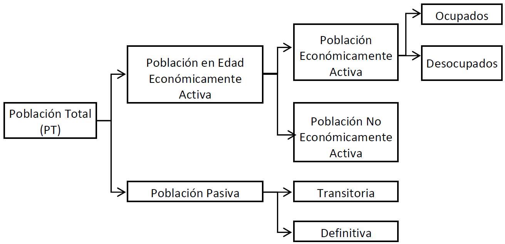
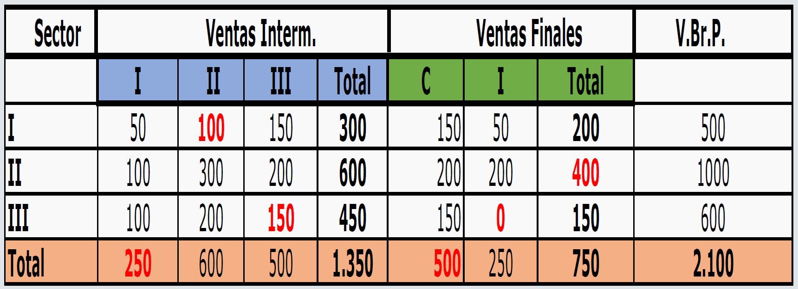
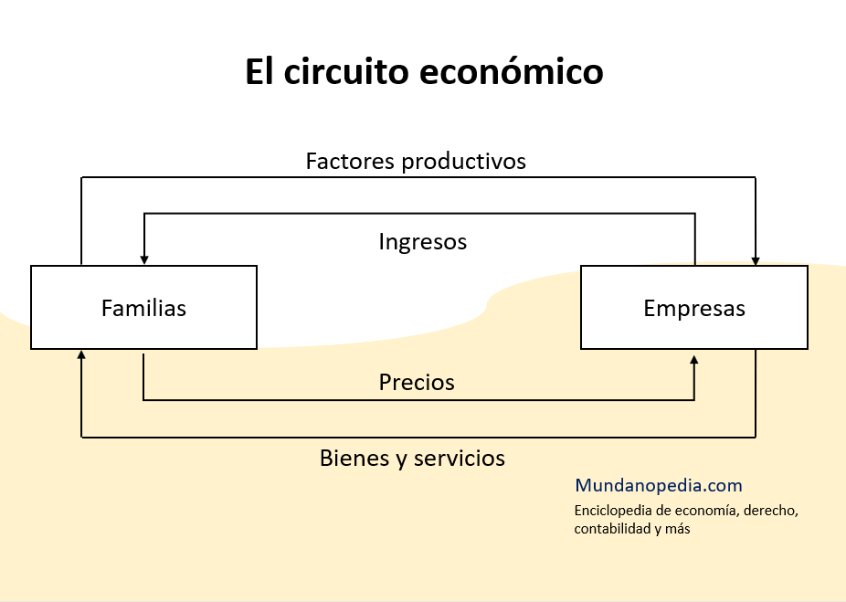
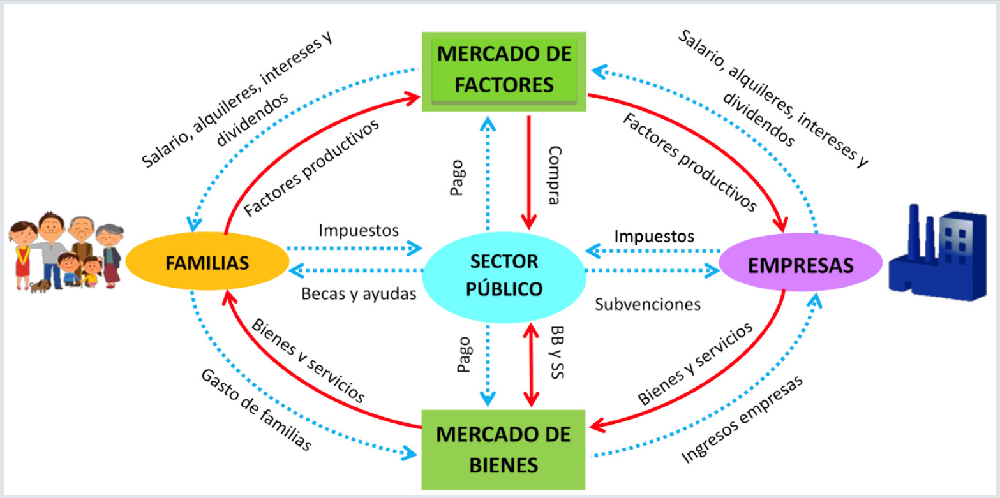
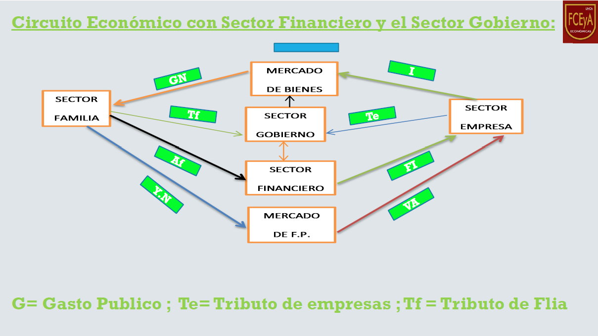
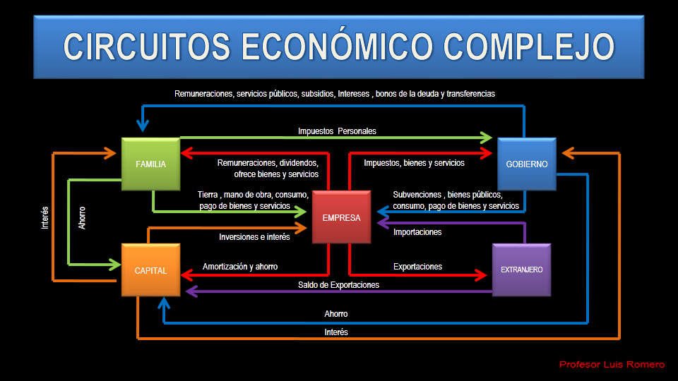

# CAPITULO 1: INTRODUCCION AL ESTUDIO DE LA MACROECONOMIA

## Concepto de Economía

Conceptualmente, podemos decir que la **Economía** es la _"cencia social que estudia los recursos, la creación de riqueza, la producción, distribución y consumo de bienes y servicios, para satisfacer las necesidades humanas"_.

En sintesis, la economía estudia la conducta humana respecto a cómo asignar los recursos escasos en el sector más productivo, para producir la mayor cantidad de bienes y servicios (en adelante ByS) posibles, a efectos de maximizar la satisfacción de necesidades, sabiendo que estas son infinitas, y que nunca podrán ser totalmente satisfechas, debido a la escasez de los recursos.

## Necesidades y bienes

Respecto de las **Necesidades**, podemos decir que, en cuanto sus características principales:

- **Son ilimitadas en número**: Esto debido a que las necesidades son particulares de cada individuo, y dependen tanto de las situaciones y condiciones en que este se encuentre en multitud de aspectos, como de los gustos y preferencias de cada uno, lo que hace que las combinaciones que generan estas necesidades sean infinitas.
- **Son limitadas en su capacidad**: Lo cual indica que las necesidades pueden ser satisfechas. Esto es más entendible analizando ejemplos, así que, por ejemplo, imaginemos el hambre. Si alguien tiene hambre, con una determinada cantidad de comida, este se saciará, la persona no podría continuar comiendo indefinidamente.
- **Son recurrentes**: Lo que implica que, si bien pueden ser satisfechas, no quedarán para siempre en ese estado, pudiendo volver a presentarse. El ejemplo del punto anterior, el hambre, es también claro ejemplo de este.

En cuanto a los **Bienes**, estos pueden ser:

- **De Consumo**: Son los bienes que se utilizar para satisfacer las necesidades de la población. Por ejemplo, una campera.
- **De Capital**: Son bienes más duraderos, que, si bien no se utilizan directamente para satisfacer necesidades, si se emplean en la producción de los Bienes de Consumo, como, por ejemplo, la máquina de coser que se utilizó para crear esa campera.

## Diferencias entre Microeconomía y Macroeconomía

La **Microeconomía** estudia las decisiones de los sectores de forma individual, considerando movimientos económicos "a baja escala", como, por ejemplo, qué variaciones sufre el precio de las naranjas, y cómo estas variaciones afectan a mercados similares, como otras frutas, o los productos derivados de las naranjas.

La **Macroeconomía**, en cambio, estudia los problemas económicos del sistema en su conjunto, analizando problemas de la economía en general y estudiando el comportamiento de las variables agregadas, como, por ejemplo, la cotización del dolar, la tasa de desempleo, cómo se comporta la cantidad de dinero, el PBI, entre otros.

## Producción y distribución de bienes y servicios

Uno de los elementos que estudia la Macroeconomía, es el denominado **Proceso Productivo**, que consiste en la unión de ciertos factores de la producción, para lograr así su objetivo, que es obtener un determinado nivel de producción.
Al hablar de **Factores**, nos referimos a aquellos que son de aplicación en la producción de ByS en toda la economía, siendo estos el Trabajo, el Capital, los Recursos Naturales, y la Tecnología.

Esto se ve reflejado en la **Función de Producción**, la cual indica la cantidad de factores que deben utilizarse para que, combinados, se obtenga como resultado cierto nivel de producción, lo que se puede expresar de la siguiente manera:

<blockquote>PT = F (T, K, RN)</blockquote>

## Análisis de los Factores

### Factor Trabajo (L)

Este no es igual a la población en total ya que la **Población Total (𝑷𝑻)** de un país está comprendida por dos grandes grupos; una donde se incluye a la **población en condiciones de trabajar (𝑷𝑬𝑬𝑨)** que tienen una edad entre 18 y 65 años, y el otro comprendido por la **población que no está en condiciones de trabajar (𝑷𝑷)**, dentro de la población pasiva existe la **Población Pasiva Transitoria (𝑷𝑷𝑻)** que son los menores de 18 años y la **Población Pasiva Definitiva (𝑷𝑷𝑫)** que son los mayores de 65 años.
En la 𝑷𝑬𝑬𝑨 una parte de ella está constituida por individuos que deciden no ofrecer sus servicios al mercado laboral (amas de casa, estudiantes, etc.), estos pertenecen a la **𝑷𝑵𝑬𝑨**, no trabajan (siempre hablando del trabajo registrado) ni buscan trabajo. Y la otra la constituye la **𝑷𝑬𝑨**, estos manifiestan su decisión de ofrecer sus servicios al mercado, a su vez estos pueden clasificarse en **Ocupados (𝑶)** que son los que tienen trabajo y los **Desocupados (𝑫)** que son los que quieren trabajar, pero no encuentran, es decir, que no toda persona sin trabajo es desocupado, sino que para ser considerado como tal debe buscar trabajo pero que por el momento no lo encuentra.

**Indicadores de la Población**

Esta clasificación de la población se analiza con diferentes tasas o índices, como:

- **Tasa de participación o de Actividad**: Es la tasa que indica realmente qué porcentaje de la población pertenece a la PEA con relación a la PT o a la PEEA.

<blockquote>TA = (PEA/PT)*100 = (PEA/PEEA)*100</blockquote>

- **Índice de Dependencia**: Indica lo que debe producir la PEA por la PP y la PNEA, ya que estos consumen pero no producen, indicando un cargo o esfuerzo extra sobre los trabajadores ocupados de mantenerse a si mismos y al resto de la población.

<blockquote>ID = (PP+PNEA)/PEA = (PT-Ocupados)/Ocupados</blockquote>

- **Tasa de Desocupación**: Indca los desocupados en relación a la PEA. Esta tasa disminuye si el desocupado encontró trabajo, o si deja de buscarlo.

<blockquote>TD = Desocupados/PEA</blockquote>

**Indicadores Demográficos**

Son indicadores o tasas que indican los factores por los cuales la PT puede cambiar.

- Tasa de Natalidad: Indica el número de nacidos vivos pro cada 1000 habitantes de una población en un determinado período.

<blockquote>TdeN = (N° de Nacidos Vivos/PT)*1000</blockquote>

- Tasa de Mortalidad: Expresa la cantidad de defunciones por cada 1000 habitantes de una población en un determinado período.

<blockquote>TdeM = (N° de Defunciones/PT)*1000</blockquote>

De estas dos tasas surge la **Tasa de Crecimiento Vegetativo**:

<blockquote>TCV = TdeN-TdeM = ((Nacimientos-Defunciones)/PT)*1000</blockquote>

- Tasa de Crecimiento Migratorio: Indica el saldo migratorio (Inmigrantes - Emigrantes) por cada 1000 habitantes en un determinado período.

<blockquote>TCM = ((Inmigrantes - Emigrantes)/PT)*1000</blockquote>

Si el TCM es positivo, indica que el país es receptor neto de población, mientras que si es negativo, indica que el país es expulsor neto de población.

- Tasa de Crecimiento Poblacional: Es la tasa a la que crece una población.

<blockquote>TCP = (Nacimientos-Defunciones+Inmigrantes-Emigrantes)/PT = (TCV + TCM)/PT</blockquote>

### Factor Capital (K)

Es la cantidad de bienes, referidos al acervo o stock de medios de producción, ocupados que tiene una economía.

**Capital Social Básico**: Es el capital mínimo necesario para que se desarrolle la economía, generalmente aportado por el Estado. Por ejemplo, escuelas, rutas, etc.

**Inversión**: Cada cierto período se produce en la economía nuevos bienes de 𝐾 que se adicionan al stock existente, estos nuevos bienes de capital constituyen la inversión del período. La inversión es el aumento en el stock de capital en el país, en general invierten las empresas, y es la compra de capital nuevo (excluye la compra de bienes usados). La inversión tiene dos partes:

1. Una parte de la inversión se destina a la reposición de los bienes de capital existentes que se han desgastados, es decir, que una parte de la inversión es para la depreciación.
2. El resto constituye una efectiva ampliación del capital de la economía, es decir, es lo que realmente aumenta el capital.

A la primera parte la denominamos **Inversión de Reposición** o Depreciación y la segunda, **Inversión Neta**. La suma de ambos conceptos, constituyen la **Inversión Bruta**.

<blockquote>Inversión BrutaT = Inversión NetaT + DepreciaciónT</blockquote>

La T hace referencia a un período de tiempo T. En símbolos, la fórmula anterior queda como:

<blockquote>KT = KT-1 + INT</blockquote>

**Capital Reproductivo**: Es el capital que sirve para producir más capital. Es conveniente distinguir el capital del capital reproductivo, ya que este último es un concepto más restringido que el otro.

<blockquote>K/P</blockquote>

Siendo **P** el Producción de Capital, la relación define cuanto K se utiliza para tener cierto nivel de Producción de Capital.

**Capacidad del Capital**: Hay que distinguir entre:

- **Capacidad Instalada**: Nos da una medida del volumen total de producción que se puede obtener con la plena utilización de todo el capital disponible.
- **Capacidad Utilizada**: Es la medida del uso efectivo de capital en un período determinado de tiempo, representa lo que realmente se utiliza.
- **Capacidad Ociosa**: Surge de la diferencia entre la capacidad instalada y la capacidad utilizada.

### Recursos Naturales (RN)

No todos los recursos naturales son factores de la producción, dado que deben cumplir con los siguientes requisitos:

- Que sean descubiertos.
- Que estén disponibles para su explotación en el lugar que se los necesite.
- Que sean rentables (hay recursos que son muy escasos y que se encuentran en un lugar muy extenso de tierra, por lo tanto, no convienen utilizarlos ya que no es rentable su explotación).

Los Recursos Naturales pueden ser:

- **Renovables**: Son aquello que no se agotan si son explotados, en principio pueden ser aplicados recurrentemente al proceso productivo, sea por la naturaleza intrínseca del recurso (Por ejemplo: saltos de agua) o por la acción del hombre para preservarlo o mejorarlo (Por ejemplo: bosques, tierra).
- **No Renovables**: Son aquellos que no pueden ser regenerados o reutilizados a una escala tal que se pueda sostener la misma tasa de consumo para siempre.

### Tecnología (t)

Es la manera en que se combinan los factores de 𝐾,𝐿 y 𝑅𝑁 en el proceso productivo y que se refleja en la función de producción:

<blockquote>𝑄=𝐹(𝐾,𝐿,𝑅𝑁)</blockquote>

En principio, podemos identificar diversas técnicas de producción aplicados a la elaboración de un bien, entonces surge la pregunta: ¿Cuál será la técnica de producción que se aplicará a la economía? Parecería razonable que entre varias técnicas alternativas para la producción de un bien se escoja aquella que permita lograr igual volumen de producción con la menor cantidad de factores.

Suponemos que para la producción de un determinado bien se dispone de dos técnicas, representadas por las funciones 𝐹1 y 𝐹2:

<blockquote>𝑄=𝐹1(𝐾,𝐿,𝑅𝑁)</blockquote>

<blockquote>𝑄=𝐹2(𝐾,𝐿,𝑅𝑁)</blockquote>

Suponemos que las funciones 𝐹1 y 𝐹2 son tales que para producir 1000 unidades del bien se requieren las siguientes combinaciones de factores:

|           | K    | L   | RN  | Q    |
| --------- | ---- | --- | --- | ---- |
| Técnica 1 | 1300 | 500 | 200 | 1000 |
| Técnica 2 | 2250 | 700 | 200 | 1000 |

Es evidente que la técnica 1 de producción es más eficiente que la segunda ya que puede obtener el mismo volumen de producción con la menor cantidad de factores.
Se trata de elegir entre varias técnicas de producción en condiciones tales que una permita ahorrar algo de factores, pero una cuestión más compleja se plantea en cambio cuando implica utilizar menor cantidad de un factor, pero utilizando más de los otros o utilizar más de ese factor, pero utilizando menos de los otros. Suponemos 2 técnicas:

|           | K    | L   | RN  | Q    |
| --------- | ---- | --- | --- | ---- |
| Técnica 2 | 2250 | 700 | 200 | 1000 |
| Técnica 3 | 2200 | 750 | 200 | 1000 |

La elección de qué factor emplear en mayor cantidad dependerá de las condiciones particulares de la economía al momento de tomar dicha decisión.

## Relaciones Industriales

Los **Sectores** son un grupo de empresas que producen Bienes o Servicios de características similares. Generalmente, la industria se divide en tres sectores, que son:

1. **Sector Primario**: O sector de extracción es el sector inicial del circuito. Su labor consiste en obtener la materia prima directamente del entorno natural. Esta labor a menudo implica emplazamientos industriales en el medio ambiente, por lo que posee un importante impacto ecológico. Los productos del sector primario, a pesar de su importancia, son los que menos valor agregado poseen en la cadena, ya que sirven como suministro para el sector secundario, y rara vez van directo al consumidor final. Y mientras más paradas haga el producto en su camino hacia éste, más valor añadido acumulará. Por eso, muchas de las economías subdesarrolladas subsisten exclusivamente de la venta de materia prima, viéndose obligadas a importar los productos elaborados.
2. **Sector Secundario**: O sector industrial, es el encargado de procesar y transformar las materias primas suministradas por el sector primario en un bien de consumo, listo para su distribución y comercialización, o bien un producto semi-elaborado que alimentará a otras industrias del sector secundario. Este proceso implica normalmente la intervención de maquinaria especializada, cuando no de procedimientos físicoquímicos que pueden ser fuente importante de contaminación, aunque no tanto como resulta el sector primario. Una vez que el producto elaborado abandona el sector secundario, se encuentra listo para su consumo y habrá por lo tanto acumulado un valor añadido, es decir, será más costoso, pues en su fabricación intervinieron diferentes procesos energéticos, industriales, mano de obra, etc. Por esa razón, este sector es el más desarrollado por las potencias industriales del mundo.
3. **Sector Terciario**: El sector terciario o sector servicios, es el encargado de suministrar a los diversos actores económicos (consumidores finales y segmentos intermedios) de diversos servicios, en lugar de productos elaborados. Es decir, se trata de proveedores de servicios, ya sean de tipo administrativo, logístico, técnico, de distribución, de comunicaciones, etc. El sector terciario es el sector de mayor empleo y mayor crecimiento en el mundo contemporáneo, y uno de los sectores que menor grado de automatización y mecanización presenta todavía.

Cada uno de estos sectores se compone de un número de empresas que, en conjunto, llevan a cabo procesos productivos para la elaboración de Bienes o Servicios. Estos bienes pueden clasificarse en dos categorías:

1. **Bienes Intermedios o Insumos**: Incluye tanto la materia prima, como los productos industrializados que sirven para la producción de bienes de consumo.
2. **Bienes Finales**: Son los bienes que, una vez atravezados todos los procesos necesarios, se convierten en Bienes de Consumo.

Teniendo en cuenta estos dos tipos de bienes, podemos determinar que la producción de cada uno de los sectores se compone de:

1. **Producción Intermedia**: Es absorbida por los diferentes sectores productivos, los cuales continúan trabajando con el fin de transformarla en producción final.
2. **Producción Final**: Es el producto que los demandantes van a buscar al mercado, el que les sirve directamente para satisfacer sus necesidades.

## Cuadro de Insumo-Producto

Este cuadro es un modelo que se utiliza para planear la economía, el cual provee de información sobre la estructura productiva de la economía:

Básicamente, lo que hace es proveer de información respecto a los flujos intersectoriales de la producción, indicando el intercambio de bienes y servicios entre los productores y los utilizadores finales.

Para interpretar la información, debemos entender que **las filas representan las compras**, mientras que **las columnas representan las ventas**, con lo cual, por ejemplo, la celda C1-3 indicaría las compras que el sector I le realizó al sector III, o bien, las ventas que el sector III le realizó al sector I, visto todo esto dentro del apartado de las **Ventas Intermedias**.

Por su parte, en la tabla de **Ventas Finales**, **la C representa las unidades dedicadas al consumo**, mientras que **la I representa las unidades dedicadas a la inversión**.

La última fila contiene las sumatorias de las columnas, mientras que la última columna tiene la sumatoria de las dos columnas totales, indicando el total de bienes que se movieron en dicho cruce de industrias, llamada **Valor Bruto de Producción**.

El **Valor Agregado** por un sector productivo es la diferencia entre el Valor Bruto de Producción del sector, menos los insumos adquiridos por el sector.

## Relación entre los conceptos de Producto y Producción

La **Producción Bruta** o **Valor Bruto de la Producción** es la producción total de ByS, tanto a nivel global como sectorial. Mientras, el **Producto Bruto** solo incluye la producción total de ByS para la demanda final. Es el valor de todos los ByS finales.

## Matríz de Requerimientos Directos

A partir de la Matriz Insumo-Producto, podemos obtener la matríz de requerimientos directos, mostrando el mismo cuadro pero expresado en porcentajes, es decir, utilizando coeficientes multiplicados por cien. La fórmula para obtenerlos es:

<blockquote>Aij = aij / VBrPij</blockquote>

## Flujo Circular o Circuito Económico Simple

El modelo de **Flujo Circular** nos permitirá ver de manera simplificada las vinculaciones entre los diferentes sectores, los agentes económicos y los mercados en una economía.

Comenzamos planteando una economía simple, con dos conjuntos de agentes económicos: Las **Familias** y las **Empresas**.

En el encontramos:

- **Flujos o Corrientes Reales**: Están expresados en unidades físicas. Son Bienes y Servicios que las empresas venden a las familias, así como factores productivos que las familias venden a las empresas.
- **Flujos o Corrientes Monetarios**: Están expresados en unidades monetarias. Corresponde a los pagos por ByS que las familias efectuan a las empresas, así como los pagos por los servicios de factores productivos que las empresas efectán a las familias.

Si incorporamos ahora los mercados,uno de ByS y otro de Factores de la producción, podemos representar los ámbitos donde las ofertas y las demandas interactúan, efectuándose en ellos la mayor parte de transacciones de ByS.

Por último, obtenemos el Circuito Económico con el Sector Gobierno, agregando las distintas interacciones que tienen mercados y actores con el Gobierno, quedando el gráfico de la siguiente forma:

Luego, agregamos el Sector Financiero, quedando el cuadro como sigue:

Aquí podemos encontrar diferentes elementos, definidos con las siguientes siglas:

- PN: Producto Nacional;
- VA: Valor Agregado;
- YN: Ingreso Nacional;
- GN: Gasto nacional;
- GP: Gasto Público;
- GT: Gastos de transferencia;
- IN: Impuestos netos de subsidios (IN = IMP - GT);
- Te: Tributo de empresas;
- Tf: Tributo de familias.

Veamos el compotamiento de algunos de estos elementos:

Cuando YN = VA, se debe a que los flujos de entrada y salida del mercado de factores productivos no se han modificado. A su vez, cuando las corrientes del sector empresa no se modifican, se da que PN = VA = YN. Como el GN sigue siendo igual al producto, y sabemos que GN = C + I + GP. Al final, tenemos que GN = PN = VA = YN.

## Circuito Económico Complejo

Su gráfica es la siguiente:

Como podemos ver, en el tenemos cinco sectores principales:

- Sector Familias;
- Sector Empresas;
- Sector Gobierno;
- Sector Capital;
- Sector Extranjero.

Para ver el modo de analizar este gráfico, podemos tomar como ejemplo al **Sector Familias**, que aporta impuestos al **Sector Gobierno**, recibiendo de el remuneraciones, servicios públicos, subsidios, bonos de deuda, entre otros; factores productivos al **Sector Empresas**, recibiendo de el remuneraciones, dividendos, bienes y servicios; y ahorro al **Sector Capital**, recibiendo de este intereses. El mismo análisis es aplicable a los demás sectores y sus relaciones.

## Sistemas de Cuentas Nacionales

Este sistema registra todas las transacciones del sistema productivo, permitiendo que, a fin de año, se emita la cantidad de ByS que se han producido. Para su confección, se tienen en cuenta los siguientes criterios:

1. A cada sector de la economía le corresponderá una cuenta;
2. En cada cuenta se registran los flujos de entradas como créditos o **Fuentes**, y los flujos de salida como débitos o **Usos**;
3. En cada cuenta se verificará la igualdad entre el total de fuentes y de usos, y, en caso de existir diferencias en algún sector, se igualará con el ahorro;
4. Cada flujo tiene 2 registraciones como uso en una cuenta y como fuente en otra cuenta.

### Análisis de las cuentas del SCN

Para el presente análisis, deberán considerarse las tablas presentadas como dos columnas, indicando Usos y Fuentes respectivamente, y cuya sumatoria de cada una de ellas nos da, al final, el indicador que se muestra en negrita.

La cuenta del **Sector Empresas** tiene los siguientes elementos:

| **Usos**                   | **Fuentes**   |
| -------------------------- | ------------- |
| Sueldos y Salarios         | Consumo       |
| Aportes a la Seg. Social   | Inversión     |
| Rentas                     | Gasto Público |
| Intereses                  | Exportaciones |
| Beneficios                 | Importaciones |
| Impuestos Indirectos Netos |               |
| Depreciación               |               |
| ------------------------   | -----------   |
| **YNB**                    | **GNB**       |

La cuenta del **Sector Familias** tiene los siguientes elementos:

| **Usos**                    | **Fuentes**           |
| --------------------------- | --------------------- |
| Consumo                     | Sueldos y Salarios    |
| Impuestos personales        | Rentas                |
| Ahorro de las Familias      | Intereses             |
|                             | Beneficios            |
|                             | Transferencias        |
| ------------------------    | -----------           |
| **Utilización del Ingreso** | **Total del Ingreso** |

La cuenta del **Sector Gobierno** tiene los siguientes elementos:

| **Usos**                          | **Fuentes**                    |
| --------------------------------- | ------------------------------ |
| Gasto Público                     | Aportes de la Seg. Social      |
| Transferencias                    | Imp. Pagadsos por las Familias |
| Ahorro del Gobierno               | Impuestos Indirectos Netos     |
| ------------------------          | -----------                    |
| **Utilización de los Ing. del G** | **Total del Ingr. del G**      |

La cuenta del **Sector Resto del Mundo** tiene los siguientes elementos:

| **Usos**                           | **Fuentes**                |
| ---------------------------------- | -------------------------- |
| Exportaciones (X)                  | Importaciones (M)          |
| Ahorro Resto del Mundo             |                            |
| ------------------------           | -----------                |
| **Utilización de los Ing. del RM** | **Total del Ingr. del RM** |

La cuenta del **Sector Ahorro-Inversión** tiene los siguientes elementos:

| **Usos**                    | **Fuentes**                   |
| --------------------------- | ----------------------------- |
| Inversión                   | Depreciación                  |
|                             | Aprotes a la Seg. Social      |
|                             | Benef. no distribuidos        |
|                             | Ahorro Sector Familias        |
|                             | Ahorro Sector Gobierno        |
|                             | Ahorro Sector Resto del Mundo |
| ------------------------    | -----------                   |
| **Utilización del Ingreso** | **Total del Ingreso**         |

### Utilidad del Sistema de Cuentas Nacionales

La información contenida en un Sistema de Cuentas Nacionales es extremadamente útil, ya que permite cuantificar la magnitud de los flujos que se generan entre las unidades del Sistema Económico.

Del Sistema de Cuentas Nacionales surgen conclusiones importantes en la relación entre las variables usadas, siendo las principales:

- La igualdad entre el Gasto y el Ingreso, que se observa en la primera cuenta.
- La definición del ahorro de las familias y del gobierno, siendo sus fórmulas **Af = Y - T - C = Yd - C**; y **Ag = T - G** respectivamente.
- La identidad entre ahorro e inversión: Dándose que **I = Depreciación + Af + Ag**; o bien **I = Af + Ag + Ae**; donde Ae es el ahorro de las empresas, que puede asimilarse a la depreciación.

## Producto, Producción e Ingreso. Métodos de Cálculo del Producto

Del análisis del circuito económico y las Cuentas Nacionales se desprende claramente que los conceptos de Producto, Ingreso, Valor Aregado y Gasto son numéricamente iguales, aunque metodológicamente distintos. Cada uno de los conceptos mencionados se calcula como:

- **Método del Producto**: La sumatoria del valor de los ByS finales producidos en la economía.
- **Método del Valor Agregado**: La sumatoria del valor que cada sector agrega a los insumos, en todas las etapas del proceso productivo, hasta llegar al consumidor final.
- **Método del Gasto**: La sumatoria de todos los gastos que realizan los sectores de la economía, que sería: Consumo (gasto de las familias) + Inversión (gasto de las empresas) + Gasto Público.
- **Método del Ingreso**: La sumatoria de las retribuciones a los factores de a producción, es decir Sueldos y Salarios + Rentas + Intereses + Beneficios + Aportes a la Seg. Social.

El producto puede ser **bruto** o **neto**, dependiendo de si incluye las depreciaciones, siendo este el bruto, o si no lo hace, siendo este el neto.

El producto es una variable expresada en pesos, ya que, al ser la suma de todos los bienes finales producidos en una economía en un período de tiempo, deben ser expresados en una unidad común, siendo esta el dinero, a efectos de poder sumar magnitudes heterogéneas. Según a qué precios se valúe el producto, este puee ser **a precios de mercado** o **a costo de factores**. La variable que diferencia uno de otros son los impuestos indirectos netos de subsidios, quedando así:

<blockquote>PBIpm = PBIcf + Imp. Ind. Netos</blockquote>

Donde **PBIpm** es el PIB al precio de mercado, mientras que **PBIcf** es el PIB al precio de costo de los factores.

Para finalizar este punto debemos diferenciar los conceptos arriba mencionados de la producción, esta no es igual al PN, ni al VA, ni al YN, ni al GN; la producción incluye los bienes finales (al igual que el producto), pero además le suma los bienes intermedios o en proceso de producción (insumos), con lo cual se sobredimensiona el verdadero valor del producto, ya que el valor de los insumos ya está incluido en el valor del bien final.

## Números Índices

Estos **números índices** se utilizan cuando estamos analizando lo que se denomina **Variables Agregadas**, que representa la suma de los productos, es decir, las ventas de una empresa, siendo su fórmula la siguiente:

<blockquote>V = Σ Pᵢ * Qᵢ</blockquote>

Lo importante con esto es saber cuanto varió la cantidad, porque lo que satisface las necesidades de las personas es la cantidad de bienes producidos, no su valor. Estas variaciones pueden ser expresadas de dos maneras:

- A **Precios Corrientes**: Es una variable expresada en los precios de cada año.
- A **Precios Constantes**: El precio permanece igual.

Mediante los números índices se llean los precios corrientes a constantes, y una vez reducida la variación de precios, podemos afirmar si aumenta o disminuye la cantidad.

Si queremos trabajar con una gran cantidad de datos, utilizamos los índices de precios. Hay distintos índices que podemos usar, pero para simplificar solo vamos a trabajar con dos índices:

- Índice de Paasche (IP): Es un cociente ponderado, donde en el numerador tenemos la cantidad de precios corrientes, y en el denominador a precios constantes. Su fórmula es:

<blockquote>IP = (Σ Pᵢᶵ * Q ᵢᶵ) / (Σ P ᵢͦ * Q ᵢᶵ)</blockquote>

Si queremos saber la relación entre dos años sin tener en cuenta el año base, hacemos:

<blockquote>(IP ᶵ - IP ᶵ⁻¹) / IP ᶵ⁻¹ = (IP ᶵ - 1) / IP ᶵ⁻¹</blockquote>

- Índice de Laspeyres (IL): La diferencia con el anterior es que el IP toma cantidades (canasta de bienes) de todos los años, mientras que el IL siempre toma la misma canasta de bienes. DE ahi surge que el IP es más acertado. Sin embargo, el IL se utiliza porque es más simple y tiene menor costo. Su fórmula es:

<blockquote>IP = (Σ Pᵢᶵ * Q ᵢͦ ) / (Σ Pᵢᶵ * Q ᵢͦ )</blockquote>

**Cambio de Bases y Deflactación**: Deflactar una serie es transformarla de percios corrientes a constantes. Esto se hace con la siguiente fórmula:

<blockquote> IL ᵀ₁ = (IL ᵀ₀ / IL¹₀) * 100 </blockquote>
