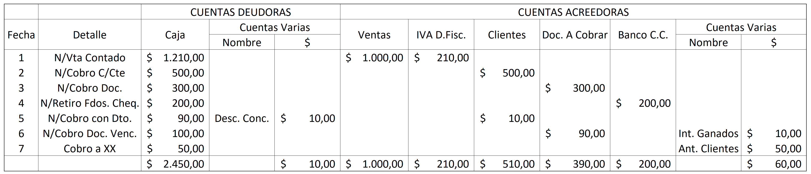
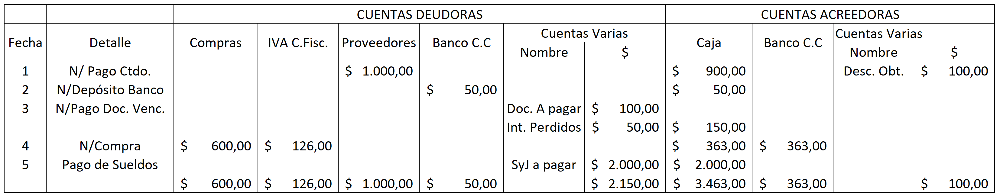
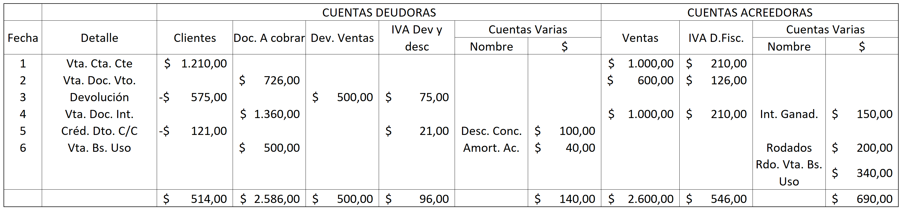
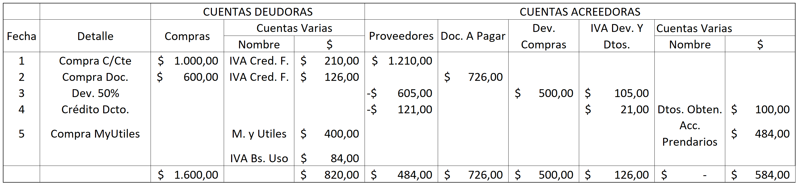

# Sistemas de registración y culminación del proceso contable

## Objeto de la contabilidad

El **objeto** de la contabilidad es brindar información referida a la situación patrimonial y financiera, de resultados (económicos) y de evolución del Patrimonio Neto. El **fin** de la misma es ayudar a tomar decisiones económicas y ejercer el control de gestión por parte de usuarios internos y/o externos.

En cuanto a sus **objetivos**, la contabilidad tiene como taales la medición del patrimonio, la determinación de los resultados y la exposición de la información. Para cumplir con ellos se requiere de un proceso que se aalimenta de datos brutos para obtener a partir de ellos datos útiles para ser utilizados por los usuarios. A este proceso se le llama **Proceso Contable**. Dicho proceso contable reconoce tres etapas:

## Etapas del proceso contable

### 1\_ La captación de datos

En este punto se utiliza un soporte llamado **comprobante**, que es un formulario donde se vuelcan los datos de los hechos económicos. Un **Hecho Económico** es aquel que tenga impacto patrimonial, financiero y economico en la organización. Los datos recibidos pueden ser generados tanto dentro de la empresa como fuera de ella.

### 2\_ Proceso contable propiamente dicho

Es donde se processan estos datos para transformarlos en información contable. Se desarrollan cuatro funciones:

1. Clasificación de los datos en cuentas.
2. Cálculo para asignar un valor al hecho económico.
3. Registración de los mismos, mediante asientos contables, utilizando el método de la partida doble y respetando la clasificación de cuentas.
4. Almacenamiento de los registros contables.

En esta etapa los soportes de almacenamiento de la información son las cuentas y los registros contables. Los registros **obligatorios** por ley son el **Libro Diario General** y el **Libro de Inventarios y Balances**. Como _no obligatorio_, tenemos al libro mayor, que en caso de servir como medio de prueba, pasa a ser considerado obligatorio.

### Salida de la información contable

En esta etapa se pone a conocimiento y disposición de los usuarios la información contable útil. El soporte de salida de la información son los **Estados Contables**, que comprenden los **Estados Contables Básicos** (ESP, ER, EEPN y EFE), y la **Información complementaria** (Notas, anexos y encabezado).

## Premisas del proceso contable

Una **premisa** es una afirmación o idea que se da como cierta, y que sirve de base a un razonamiento o discusión. En la contabilidad, existen las siguientes:

1. **Ecuación contable fundamental**. Determina que _Activo = Pasivo + Patrimonio Neto_. Esta ecuación significa que dentro del activo tenemos todos los recursos económicos que tiene la empresa, y que su origen pudo derivar de dos fuentes de financiamiento: **Propias** (Patrimonio Neto) y **Ajenas** (Pasivo).
2. **Método de registración por partida doble**: Es una técnica de registración que consiste en debitar una o más cuentas y acreditar una o más cuentas, siempre verificando la igualdad de la suma de movimientos producidos en el _debe_ y en el _haber_. Todo hecho económico tiene su origen en otro hecho del mismo valor pero de naturaleza contraria.
3. **Registración de los hechos económicos-financieros en base devengada**: La imputación de los hechos se sustenta en la base devengada, no en el criterio de lo percibido. El **criterio de lo devengado** dice que los efectos patrimoniales de las transacciones o hechos deben reconocerse en el ejercicio y momento en el cual ocurren, con independencia de la fecha de su pago o de su cobro.
4. **Normas técnicas contables**: Con respecto a las normas técnicas, se registra siempre por el criterio jurídico, que casi siempre coincidirá con el criterio económico, ya que se debe respetar la ley. El criterio jurídico está dado por el Código Civil y Comercial de la Nación, la Ley General de Sociedades y las Normas Contables (Resoluciones Técnicas). Cuando estos criterios no coinciden, como en el caso de los créditos por especie tipificados en el CCyC, se da entonces preeminencia a la realidad económica. En síntesis, la norma es registrar de acuerdo al criterio legal, y, como excepción, se registra bajo el criterio económico.

## Sistemas de Información Contable (SIC)

Un **Sistema** se trata de un _conjunto ordenado de normas u objetos_ acerca de determinada materia (en este caso, de contabilidad). El **SIC** es un conjunto de reglas que mediante el uso de técnicas (teneduría de libros) permite capturar, clasificar, ordenar y registrar datos de carácter fundamentalmente económico para luego brindar información contable a un conjunto indeterminado de usuarios que actúan dentro y fuera de la organización. Este sistema tiene como función básica brindar información que permita:

1. Planificar basándose en la información generada.
2. Coordinar el desarrollo de las actividades que lleva adelante la empresa.
3. Controlar los resultados alcanzados.

El SIC que se emplee dependerá de cuál es la actividad principal del ente y la dimensión de su estructura. No obstante, el SIC siempre debe responder a los principios de _transparencia_ y _calidad_ de la información contable.

El SIC se compone del Subsistema de Información Interno, y de un Subsistema de Información de Uso Externo.

### Componentes del Subsistema de Información de Uso Interno

1. Área que fijan objetivos y políticas: En ella están los dueños y accionistas que fijan las políticas de crecimiento, rentabilidad, sueldos, etc.
2. Área de planeamiento: Planifican acciones financieras, económicas y técnicas para alcanzar los objetivos que se plantearon.
3. Información gerencial: Esta área elabora informes para los responsables que conducen la empresa. Todos estos informes brindan:
   - Perspectiva financiera: sobre rentabilidad, liquidez, ciclos de cobranzas y pagos, etc.
   - Perspectiva del cliente: Objetivos de ventas totales, ventas al mercado local y externo, participación en el mercado local.
   - Perspectiva del proceso interno: Rotación del stock, capacidad de producción, máxima de ausentismo, personal temporario, etc.
   - Perspectiva social externa: Cómo nos ve la comunidad.
   - Perspectiva social interna: Cómo nos ven nuestros empleados.
4. Área de ejecución: Encargada de la actividad operativa.
5. Área de control: El objetivo de esta área es estudiar las causas que producen las variaciones entre lo planificado y lo ejecutado.
6. Oportunidades y restricciones del mercado.

### Componentes del Subsistema de Información de Uso Externo (el que nos interesa en esta materia)

Este subsistema utiliza como soporte la misma base de datos que el SIC interno, garantizando así el control, reduciendo el costo de los procesos y mejorando la calidad de los informes.

La información externa se prepara en base a las regulaciones **legales** del CCyC, y a las regulaciones **técnicas** de las Normas Contables Profesionales. Esta información se suministra a través de los Estados Contables.

## Sistemas de Registración

En los Sistemas de Registración se distinguen tres tipos:

1. **Sistema de registración directa**, Cuando solo se utiliza el Libro Diario General y el Libro Mayor.
2. **Sistema de registración directa con mayores auxiliares**, cuando se incorporan submayores.
3. **Sistema de registración indirecta o descentralizada**, cuando se incorporan los subdiarios, permitiendo analizar en profundidad las operaciones repetitivas en los subdiarios, facilitando la división de trabajo y aumentando el control interno.

Tanto la primera como la segunda forma se denominan **Sistemas de contabilidad centralizados**, porque los documentos originales se vuelcan directamente al diario general, sin pasar por otro registro previo.

### Componentes de los sistemas de registración

- Información contable procesable (datos);
- Un conjunto de comprobantes donde se vuelcan los datos;
- Un conjunto de cuentas bajo un mismo plan de cuentas;
- Un conjunto de registros que interactúan entre sí, en forma tanto sistemática como cronológica.
- Flujo o circuito de información, en referencia a la rutina o circuito por donde fluyen los datos desde la documentación fuente hasta su salida como información útil. Responde a las preguntas de ¿Qué hago con los datos? ¿Dónde los registro?

El uso de los distintos sistemas de registración vistos depende del tamaño de la empresa, o bien de la cantidad y/o calidad de información que esta requiera.

En base a todo lo visto, podemos determinar que un **Sistema de Registración Contable** (SRC), **conceptualmente**, es la combinación coordinada de un conjunto de comprobantes, cuentas y registros que interactúan entre sí, y con la rutina o circuito que sigue la información contable. Estos SRC se clasifican, de acuerdo con los tipos vistos, en tres diferentes:

### Sistema Directo Propiamente Dicho

Aquel que emplea como registros el Libro Diario General, el Libro Mayor General y el Libro de Inventarios y Balances. Es muy utilizado en empresas pequeñas, pero tiene la desventaja de dificultar la división de trabajo y limitar el grado de análisis de la información.

### Sistema Directo con Mayores Auxiliares

Aquel que, además de los tres mencionados anteriormente, también emplea como medio de registro los Mayores Auxiliares. Este sistema también se suele utilizar en entes pequeños, y tiene las mismas desventajas que el sistema anterior.

### Sistema Indirecto o Descentralizado

Este sistema combina los registros utilizados en el Sistema Directo Propiamente Dicho, pero combinándolos con el uso de Subdiarios, agrupando en estos últimos los registros de hechos de naturaleza similar, para luego realizar, cada un determinado período (generalmente mensual), un asiento resumen que será trasladado al Libro Diario General, y desde el cual luego se llevará al Libro Mayor General. Estos subdiarios facilitan la división de trabajo, mejoran el control interno, y posibilitan un mayor análisis de la información.

## Subdiarios

Antes de analizar cada subdiario y ver el funcionamiento, se debe tener en cuenta algunos aspectos referidos a la forma de registrar:

1. **Compras y ventas mixtas**: Cuando una compra o venta es mitad contado y mitad a crédito, se registra una parte de la misma en los subdiarios de compras o ventas, y la parte de contado en la Caja Ingreso o Caja Egreso. Otra alternativa es considerar toda la compra como un crédito, y luego en el subdiario caja correspondiente registrar la mitad correspondiente al contado.
2. **Emisión de cheques**: Se registran en Caja Ingresos primero por la emisión del cheque, que se mantiene en caja. Cuando se realiza el pago, el mismo se registra en el libro Caja Egresos.
3. **Descuentos concedidos por cobranzas** (perdidas o descuentos de caja): Se registra en el Subdiario Caja Ingreso, debitando Caja por el cobro líquido, y también debitando la cuenta _Descuentos concedidos_ en la columna de cuentas varias. Luego se acredita la cuenta _Clientes_ o _Deudores por ventas_ por la sumatoria de ambos importes.
4. **Descuentos obtenidos** (ganancias o descuento de caja): Los descuentos se registran en el Subdiario Caja Egreso, porque lo primero es el pago, acreditando el pago de acuerdo con la forma en que se lo haya hecho, y en cuentas varias se registran los descuentos obtenidos, debitando los mismos. Por otro lado, el cargo será a proveedores, registrándolos en la columna deudora.
5. **Compras y ventas mixtas con intereses**: Cuando los intereses de estas compras y ventas no se abonan o se cobran en el momento de la operación, se registran en el subdiario compra o venta, en las cuentas varias, teniendo en cuenta que se cargan a, por ejemplo, proveedores, clientes, documentos a pagar, documentos a cobrar, etc. La parte del contado se imputa en Caja Ingreso o Caja Egreso. Si los intereses se abonan al momento de la compra o venta, se registra la parte a crédito en los subdiarios de compra o venta, y en Caja Ingreso o Caja Egreso se registra el pago o cobro al contado junto con los intereses en la parte de cuentas varias.
6. **Devoluciones de ventas**: Cuando se otorga una nota de crédito, se debita en el subdiario ventas la cuenta _Devoluciones sobre ventas_ y se acredita _Clientes_ o _Documentos a cobrar_, registrándolas en este caso dentro de la columna Cuentas Varias, o bien registrando el monto entre paréntesis dentro de sus respectivas columnas. En caso de que por la devolución de ventas se deba devolver o entregar un cheque o efectivo, se registra en el subdiario de Caja Egreso, acreditando _Caja_ o _Banco_ por el monto, y debitando en Cuentas Varias la devolución de venta.
7. **Devoluciones de compras**: Cuando recibimos una nota de crédito, la misma se registra en el subdiario de compra, en la columna _Devoluciones sobre compras_, y en la columna _Proveedores_ o _Documentos a pagar_ con signo cambiado. En caso de que por la devolución de ventas tenga como consecuencia la entrega de un cheque o efectivo, se anota en el Subdiario Caja Ingreso, debitando la cuenta _Caja_ o _Banco_ y acreditándose en Cuentas Varias la devolución de compras.

Ahora sí, veamos los distintos subdiarios:

### Subdiario Caja Ingreso

Refleja los motivos por los cuales ingresa dinero o sus equivalentes a la empresa, los cuales pueden ser:

- Por una venta al contado.
- Por cobranzas a los clientes.
- Por cobro de documentos.
- Por extracción de dinero de la cuenta corriente bancaria.
- Por aportes de los socios.
- Otros motivos varios.

En base a esto, en el diseño de los subdiarios tendremos dos grupos de columnas, un grupo de _cuentas deudoras_, y otro grupo de _cuentas acreedoras_. Al haber tantas transacciones posibles, las cuentas que seleccionemos nunca serán suficientes. Por eso se utiliza la columna _Cuentas Varias_, tanto en cuentas deudoras como acreedoras, donde se registrarán los movimientos menos repetitivos, ampliando así la posibilidad de registros y evitando la necesidad de acudir al Libro Diario General.

### Subdiario Caja Egresos

Realiza el mismo análisis que el anterior, pero reflejando principalmente la salida de dinero del ente, tanto desde Caja como desde Banco, ya sea por pagos a proveedores, acreedores, documentos a pagar, compras al contado, gastos, depósitos bancarios, etc.

### Subdiario de ventas a crédito

Como ya vimos, se puede presentar un problema cuando la venta es mixta. Para este caso, como también vimos, la solución está en, o bien registrarla totalmente como crédito y luego registrar como pago parcial la parte de contado, o bien registrándola como dos ventas distintas, una a crédito y la otra a contado, cada una por su correspondiente importe.

La venta de mercadería se debe considerar que puede ser tanto a cuenta corriente como documentada. Entonces, en las _columnas deudoras_, se debe considerar _Clientes_ y _Documentos a cobrar_. También puede pasar que la mercadería vendida sea devuelta, por el motivo que sea. En este caso, si no tenemos la cuenta _Devoluciones sobre ventas_ en el Libro Diario General, lo que se hace es debitar la cuenta _Devoluciones sobre ventas_, y acreditar la cuenta _Clientes_.

En caso de que la venta genere intereses por el plazo de crédito, se acreditaría _Ventas_ e _Intereses (+) a devengar_, debitándose la cuenta _Documentos a cobrar_ por el total de la venta más los intereses.

Si se diera que en la venta a crédito otorgáramos un descuento, por el concepto que fuere, emitiéndose luego una nota de crédito al cliente, lo que se hace en el subdiario es, posterior a registrar la venta, debitar la cuenta _Descuentos otorgados_, y acreditar la cuenta _Clientes_ o _Deudores por ventas_.

### Subdiario de compras a crédito

Siguiendo la estructura de los subdiarios anteriores, en este subdiario en la columna deudora se consideran las cuentas _Compras_ e _IVA_, además de las _Cuentas varias_. En la columna acreedora habrá cuentas dependiendo de las diferentes modalidades de compras que haya.

Una vez se termina de registrar en todos los subdiarios, corresponde hacer el traspaso de información al Libro Diario General. Para ello, se realizan **asientos resumen** que, según la legislación vigente, engloban información dividida en períodos de tiempo. Los distintos asientos pueden verse así:

- **Asiento por Subdiario Caja Ingreso**:

| Cuenta                                                      | Debe | Haber |
| ----------------------------------------------------------- | ---- | ----- |
| Caja                                                        |      |       |
| a Varios                                                    |      |       |
| Por ingresos del mes, según Subdiario de Ingresos Folio "x" |      |       |

- **Asiento por Subdiario Caja Egreso**:

| Cuenta                                                     | Debe | Haber |
| ---------------------------------------------------------- | ---- | ----- |
| a Varios                                                   |      |       |
| Caja                                                       |      |       |
| Por egresos del mes, según Subdiario de Ingresos Folio "x" |      |       |

- **Asiento por Subdiario Ventas a Crédito**:

| Cuenta                                                                 | Debe | Haber |
| ---------------------------------------------------------------------- | ---- | ----- |
| Varios                                                                 |      |       |
| a Ventas                                                               |      |       |
| Por ventas en cta. cte. del mes, según Subdiario de Ingresos Folio "x" |      |       |

- **Asiento por Subdiario Compras a Crédito**:

| Cuenta                                                                  | Debe | Haber |
| ----------------------------------------------------------------------- | ---- | ----- |
| Compras                                                                 |      |       |
| a Varios                                                                |      |       |
| Por compras en cta. cte. del mes, según Subdiario de Ingresos Folio "x" |      |       |

## Diario tabulado o columnado

Este diario forma parte de la etapa del Sistema de Registración Directa o Centralizado. En esencia, el Libro Diario General y el Tabulado representan lo mismo, la diferencia está en que el tabulado no necesita registrar el nombre de la cuenta porque ya están en el margen superior.

Una ventaja evidente de este libro es que se ahorra tiempo al no tener que anotar los nombres de las cuentas, además de que el diseño permite mayorizar rápidamente, anotando los saldos de cada cuenta en la parte inferior de las mismas. Su problema es que, para sistemas de cuentas grandes, se requerirá de un uso excesivo de la columna _Cuentas varias_, perdiéndose así la posibilidad de control.

## Medios de registración

De acuerdo con la historia, se clasifican en:

- **Manual**: Los registros se realizaban de puño y letra. Es un sistema lento e inaplicable cuando el número de operaciones es grande. Esto último lleva a la división en subdiarios, permitiendo descentralizar las tareas, pero ello no evita la complejidad y cantidad de operaciones a realizar.
- **Electromecánico**: Este sistema combina máquinas de escribir de carro ancho y una calculadora que sumaba y restaba, que permitía avanzar y retroceder, así como sumar y restar para obtener saldos. Así, comparado con el manual, se lograba mucha más velocidad y control en la obtención de saldos.
- **Procesamiento Electrónico de Datos** (PED): El avance de la tecnología permite una capacidad muy superior de realizar cálculos y anotaciones, tanto en calidad como velocidad y almacenamiento. Estos sistemas se componen tanto de Hardware como de Software.

## Culminación del proceso contable

Como habíamos visto, con la información recabada durante el proceso contable se elaboran informes. La elaboración de estos, además de ser super importante, constituye la culminación del proceso contable.

### Prebalance

La etapa del prebalance se inicia con el análisis y control del Libro Mayor General, el cual se realiza mediante una prueba mecánica de exactitud cuantitativa del proceso de registración por partida doble, denominado balance de comprobación.

INSERTAR GRÁFICA

Este balance puede comprobar o analizar cuantitativamente los saldos de las cuentas del mayor, en este caso denominado **Balance de comprobación de saldos**. Lo que se busca es que la suma de los saldos de todas las cuentas del _Debe_ coincida con las del _Haber_. Además, también puede realizarse una comprobación de los movimientos del saldo, en este caso denominándose **Balance de sumas y saldos**. Entre los **objetivos** del prebalance, encontramos los:

- De control.
- De servir como base para el análisis conceptual de los saldos del Libro Mayor.
- De servir para la preparación de los informes contables.

Los objetivos señalados por la doctrina son:

1. **Control de la mayorización**: Comprueba si los pases del libro Diario al Mayor se hicieron en su totalidad.
2. **Verificar el cumplimiento del equilibrio Débito-Crédito**
3. **Servir de base para realizar asientos de ajuste**: Con estos se culmina la preparación para la formulación de los Estados Contables.

En cuanto a sus **limitaciones**, encontramos que:

1. No detecta la omisión de un asiento completo en el Libro Diario General.
2. No prueba sobre la calidad del contenido de los asientos del Libro Diario General. Pueden haberse realizado malas imputaciones, o que el asiento esté invertido.
3. No prueba la calidad de la mayorización, porque, aunque el asiento esté bien en el diario, puede ser mayorizado de forma invertida, o utilizar cuentas en el Mayor distintas a las usadas en el Diario.
4. En general no se detectan cualquier tipo de error siempre que los importes debitados sean iguales a los acreditados.

Cabe resaltar que este balance es solo válido para el caso de medios manuales de registración, donde los errores de cálculo son factibles de producirse. Con la utilización de PED, estas pruebas mecánicas no son necesarias. Pero, si bien es algo que no se realiza en la práctica contable, es importante entender el funcionamiento para poder manipular este tipo de sistemas y saber leerlos.

En cuanto a **diseños**, los prebalances se confeccionan en una hoja de trabajo que contiene un conjunto de columnas de datos, tanto cualitativos como cuantitativos, siguiendo generalmente esta estructura:

1. Narrativas o cualitativas: Con una columna para el código de la cuenta, y una columna para el nombre de la cuenta, ordenadas de acuerdo con el plan de cuentas.
2. Valorativas o cuantitativas: Con un columna doble (debe y haber) para la suma de los movimientos; una columna doble para los saldos tanto deudores como acreedores; una columna doble para movimientos de ajuste tanto deudores como acreedores, una coluna doble para los saldos ajustados tanto deudores como acreedores; una clumna doble para los saldos patrimoniales (A = P + PN); y una columna doble para los saldos diferenciales (egresos al debe mas ingresos al haber).

Sobre las **oportunidades para su confección**, se suele hacer en períodos menores al ejercicio económico, generalmente de forma mensual, aunque en las empresas financieras su confección es diaria. Como podemos ver, su confección depende del tipo de empresa, de los deseos de sus administradores, y de la mayor o menor necesidad de control. Además, siempre se confecciona al final del ejercicio, previo a la confección del **Balance General**, con el fin de que los Estados Contables del ente revelen con la mayor exactitud posible la situación patrimonial y la evolución del Patrimonio Neto ocurrido en el período.

Sobre los **asientos de ajuste**, su finalidad es la correción de los saldos de las cuentas para que muestren mayor exactitud (valor real) al final del período. Estos asientos permiten:

1. Corregir errores u omisiones;
2. Utilizar correctamente la base devengada para imputar los hechos económicos;
3. Corregir la inexistencia de operaciones de registros diferidos;
4. Corregir cualqueir circunstancia donde los datos a procesar no se evidencien de forma explícita en la documentación de respaldo.

Debe tenerse en cuenta que los asientos de ajuste son de caracter especial y no repetitivos, y que deben realizarse directamente en el Libro Diario General, y no así en Subdiarios. En cuanto a los tipos de asientos de ajustes posibles, tenemos:

1. Asientos para corregir errores y/u omisiones, que se realizan cuando son detectados;
2. Asientos con motivo de balance, que se realizan al cierre del ejercicio, para lograr una correcta imputación de los saldos en donde correspondan (Activo, Pasivo, Patrimonio Neto, Ingresos o Egresos).

### Balance General (sintesis)

Se llama **Balance General** al conjunto de operaciones de contabilidad que tienen por objeto determinar en un momento dado cual ha sido el resultado económico de las actividades que desarrolló un ente.

## Resumen del proceso visto

- El ingreso al proceso contable se hace a través de los comprobantes.
- Los comprobantes van al Libro Diario General, pudiendo usarse mayores auxiliares o subdiarios.
- Las cuentas del Libro Diario General se pasan, mayorizandose, al Libro Mayor General.
- Se procede a realizar el Balance de Comprobación de Sumas y Saldos.
- Se realizan los asientos de ajuste.
- Se realizan los ajustes al cierre. Estos no deben confundirse con los anteriores, ya que los ajustes al cierre se refieren a las cuentas de resultado que se deben cerrar al cerrar el ejercicio, mientras que los asientos de ajuste, como vimos, son para la corrección de errores u omisiones.
- Se confeccionan los Estados Contables.
- Los Estados Contables se copian en el Libro Inventarios y Balances.
- Se realizan los asientos de inicio del nuevo ejercicio.

## Modelos contables

Un **Modelo Contable** es una representación de la realidad que permite su comprensión, así como el estudio del comportamiento de ciertos aspectos de esta. Los Estados Contables tratan de explicar la situación patrimonial, financiera y económica de los entes que los emiten, así como también de su evolución a lo largo del tiempo. Por tanto, el conjunto de criterios utilizados para confeccionar los Estados Contables constituye un Modelo Contable.

Por ello, si es que hablamos de los Modelos Contables, decimos que estos son una representación de la realidad financiera, económica y patrimonial de un ente, que permiten su comprensión y el estudio de su comportamiento en ciertos aspectos de la realidad, permitiendo determinar los resultados de las acciones del mismo.

Algunos criterios importantes a tener en cuenta en los Modelos Contables tiene que ver con:

- **La unidad de medida**: Este criterio atiende a los aspectos de la moneda como común denominador de los valores.
- **Los criterios de medición contable (valuación)**: Este criterio atiende a la asignación de valores, tanto historicos como corrientes.
- **El capital a mantener para que exista ganancia**: Relacionado con el concepto de la determinación de resultados.

## Introducción a los Estados Contables

Como introducción alos mismos, podemos tomar el **marco conceptual** previsto por la **R.T. N° 16**, que indica:

**Objetivos**: El objetivo principal es proveer sobre el patrimonio del ente emisor una fecha (FC), y su evolución económica y financiera por el período que abarca (ejecución económica), para facilitar la toma de decisiones económicas.

**Requisitos**:

1. Pertinencia (conexión entre dos o más casos);
2. Confiabilidad o credibilidad, en cuanto a la aproximación a la realidad (sustancia/forma) y neutralidad (objetividad o ausencia de socios);
3. Integridad;
4. Verificabilidad;
5. Sistematicidad;
6. Claridad;
7. Equilibrio entre costos y beneficios.

**Elementos de los Estados Contables**:

1. La situación patrimonial del ente a fecha de cierre;
2. La evolución del Patrimonio Neto;
3. La evolución de la situación financiera.

**Modelos Contables**:

1. La unidad de medida;
2. Los criterios de medición contable;
3. El capital a mantener para que exista ganancia.
